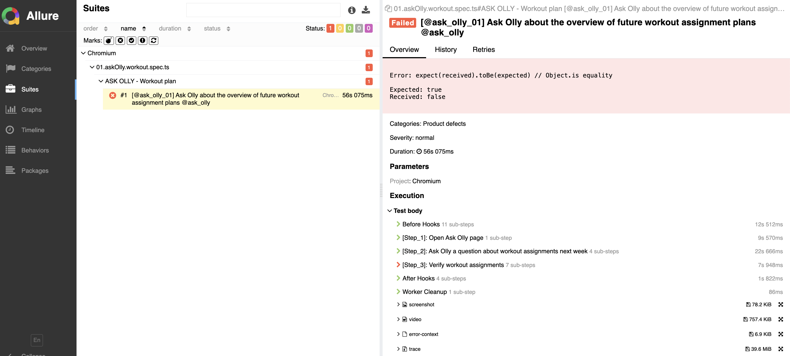
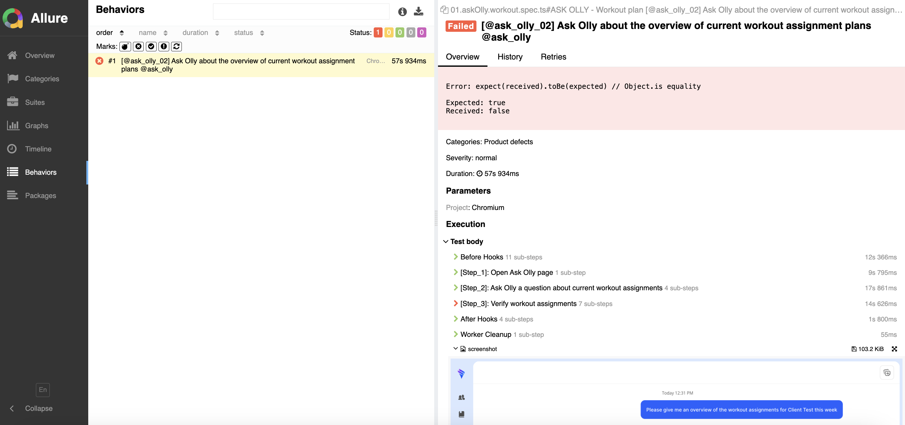
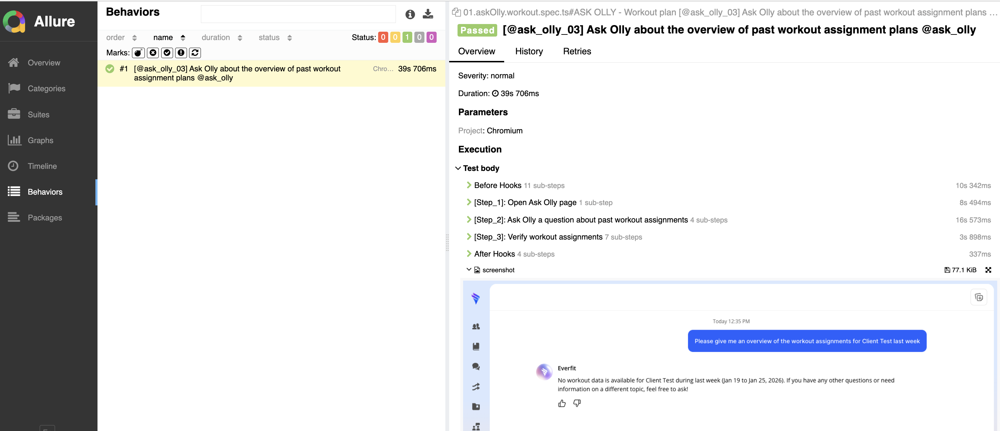

# Playwright Testing Framework - Everfit Demo

A comprehensive E2E testing framework built with Playwright and TypeScript, featuring AI-augmented validation for Ask Olly responses.

## 📑 Table of Contents
- [AI & Gemini Highlights](#-ai--gemini-highlights)
- [Framework Structure](#-framework-structure)
- [Features](#-features)
- [Test Suites](#-test-suites)
- [Running Tests](#-running-tests)
- [Reporting](#-reporting)
- [Setup Instructions](#-setup-instructions)

## 🤖 AI & Gemini Highlights

This project integrates Gemini to validate Ask Olly responses against real data, not just UI expectations. The flow pairs prompts with API-backed workout assignments and uses AI-based assertions to confirm the response content is accurate and meaningful.

**What I implemented:**
- Gemini client configuration and access layer
- AI assertions for workout overview validation
- Prompt templates that drive deterministic AI checks
- End-to-end flow that compares UI responses with API data

---

## 🏗️ Framework Structure

The framework follows a modular architecture with clear separation of concerns:

```
everfit_demo/
├── ai/                           # AI validation & Gemini integration
│   ├── assertions/
│   │   └── workout.assert.ts     # AI-based workout verification
│   └── gemini/
│       ├── aiClient.ts           # Gemini client setup
│       └── aiConfig.ts           # Gemini configuration
├── api/                          # API testing layer
│   ├── auth/
│   │   └── auth.api.ts           # Auth-related API methods
│   ├── core/
│   │   └── api.client.ts         # Reusable API client with request/response handling
│   └── workout/
│       └── workout.api.ts        # Workout-specific API methods
├── assertions/                   # Custom assertion modules
│   └── askOlly.assert.ts         # Ask Olly UI verification
├── common/                       # Shared utilities
│   └── allureReport.ts           # Allure reporting configuration
├── configurations/               # Environment and validation configs
│   ├── auth.config.ts            # Authentication configuration
│   ├── env.config.ts             # Multi-environment configuration (dev/staging/prod)
│   └── validation.config.ts      # Environment variable validation
├── data/                          # Test data & prompts
│   └── promts/
│       └── askOlly.prompt.ts     # Ask Olly prompt templates
├── fixtures/                     # Playwright fixtures for dependency injection
│   └── auth.fixture.ts           # Authentication fixtures
├── helpers/                      # Helper functions
│   └── time.helper.ts            # Time-related utilities
├── pages/                        # Page Object Model
│   ├── askOlly.page.ts           # Ask Olly page methods
│   ├── base.page.ts              # Base page with common methods
│   ├── client.page.ts            # Client navigation methods
│   └── login.page.ts             # Login page methods
├── selectors/                    # Centralized element selectors
│   ├── askOlly.selector.ts       # Ask Olly selectors
│   ├── login.selector.ts         # Login selectors
│   └── menu.selector.ts          # Menu selectors
├── tests/                        # Test specifications
│   ├── 01.askOlly.workout.spec.ts      # Ask Olly workout plan tests
│   └── 02.askOlly.conversation.spec.ts # Ask Olly conversation tests
├── playwright.config.ts          # Playwright configuration
├── package.json                  # Dependencies and scripts
└── tsconfig.json                 # TypeScript configuration
```

## 🚀 Features

- ✅ **AI-Enhanced Validation** - Gemini-backed checks to validate Ask Olly responses against real API data
- ✅ **Page Object Model (POM)** - Maintainable and scalable UI abstraction
- ✅ **API Testing Support** - Built-in API client for backend validation
- ✅ **Multi-Environment Support** - Easy switching between dev/staging/production
- ✅ **Cross-Browser Testing** - Chromium, Firefox, and WebKit support
- ✅ **Fixtures Pattern** - Dependency injection for cleaner test code
- ✅ **Allure Reporting** - Rich HTML reports with steps, screenshots, and videos
- ✅ **Custom Assertions** - Domain-specific verification methods
- ✅ **Tag-Based Execution** - Run specific test suites using tags (@login, @regression, etc.)
- ✅ **Video & Screenshots** - Automatic capture on test failure
- ✅ **TypeScript** - Type safety and better IDE support

---

## 🧪 Test Suites

### 1. Ask Olly Workout Plan Tests
**File**: [tests/01.askOlly.workout.spec.ts](tests/01.askOlly.workout.spec.ts)

#### TC_ASK_01: Ask Olly about next week workout plan

**Tags**: `@ask_olly_01`, `@ask_olly`  
**Execution:** `ENV=dev HEADLESS=false npm run test -- --grep '@(ask_olly_01)' --project=Chromium`
**Description**: Validates Ask Olly response against next-week workout assignments
**Report:**


**Test Steps**:
1. Open Ask Olly page
2. Ask Olly about next-week workout assignments
3. Fetch workout assignments via API
4. Verify AI response matches workout overview

**Expected Results**:
- Olly response is returned successfully
- Response content aligns with API workout assignments

**Technical Implementation**:
- Uses Page Object Model (AskOllyPage, ClientPage)
- API validation via `fetchWorkoutAssignments`
- AI verification via `verifyWorkoutOverviewByAI`
- Allure step-by-step reporting

---

#### TC_ASK_02: Ask Olly about this week workout plan

**Tags**: `@ask_olly_02`, `@ask_olly`  
**Execution:** `ENV=dev HEADLESS=false npm run test -- --grep '@(ask_olly_02)' --project=Chromium`
**Description**: Validates Ask Olly response against current-week workout assignments
**Report:**


**Test Steps**:
1. Open Ask Olly page
2. Ask Olly about this-week workout assignments
3. Fetch workout assignments via API
4. Verify AI response matches workout overview

**Expected Results**:
- Olly response is returned successfully
- Response content aligns with API workout assignments

---

#### TC_ASK_03: Ask Olly about last week workout plan

**Tags**: `@ask_olly_03`, `@ask_olly`  
**Execution:** `ENV=dev HEADLESS=false npm run test -- --grep '@(ask_olly_03)' --project=Chromium`
**Description**: Validates Ask Olly response against past-week workout assignments
**Report:**


**Test Steps**:
1. Open Ask Olly page
2. Ask Olly about last-week workout assignments
3. Fetch workout assignments via API
4. Verify AI response matches workout overview

**Expected Results**:
- Olly response is returned successfully
- Response content aligns with API workout assignments

---

### 2. Ask Olly Conversation Tests
**File**: [tests/02.askOlly.conversation.spec.ts](tests/02.askOlly.conversation.spec.ts)

#### TC_CONV_01: Start a new chat successfully

**Tags**: `@convor_01`, `@ask_olly`  
**Execution:** `ENV=dev HEADLESS=false npm run test -- --grep '@(convor_01)' --project=Chromium`

**Description**: Validates that user can reset the conversation and start a new chat

**Test Steps**:
1. Open Ask Olly page
2. Ask an initial question
3. Wait for Olly to finish streaming response
4. Start a new chat
5. Verify message container and URL are reset

**Expected Results**:
- Chat history is cleared
- URL returns to base Ask Olly state

**Technical Implementation**:
- Uses Page Object Model (AskOllyPage, ClientPage)
- Custom assertions `verifyMessageContainerReseted`, `verifyAskOllyURLReseted`
- Allure step-by-step reporting

---

#### TC_CONV_02: Ask multiple prompts in one conversation

**Tags**: `@convor_02`, `@ask_olly`  
**Execution:** `ENV=dev HEADLESS=false npm run test -- --grep '@(convor_02)' --project=Chromium`

**Description**: Validates multi-turn conversation flow

**Test Steps**:
1. Open Ask Olly page
2. Ask about this-week workout assignments
3. Wait for Olly response
4. Ask about next-week workout assignments
5. Verify total message count

**Expected Results**:
- Conversation contains 4 messages total
- Multi-prompt flow is successful

---

## 🏃 Running Tests

### Basic Commands

| Command | Description |
|---------|-------------|
| `npm run test` | Run all tests |
| `npm run test:ui` | Interactive UI mode |
| `npm run test:headed` | Browser visible mode |
| `npm run test:debug` | Debug mode |

### Run by Test ID or Tag

| What to Run | Command |
|-------------|---------|
| Specific test by ID | `npm run test -- --grep '@(ask_olly_01)'` |
| Ask Olly tests | `npm run test -- --grep '@(ask_olly)'` |
| Workout plan tests | `npm run test -- --grep '@(ask_olly_01\|ask_olly_02\|ask_olly_03)'` |
| Conversation tests | `npm run test -- --grep '@(convor_01\|convor_02)'` |
| Multiple tags | `npm run test -- --grep '@(ask_olly\|convor_02)'` |

### Run by Browser

| Browser | Command |
|---------|---------|
| Chromium | `npm run test -- --project=Chromium` |
| Firefox | `npm run test -- --project=Firefox` |
| WebKit | `npm run test -- --project=WebKit` |
| All browsers | `npm run test` |

### Run by Environment

| Environment | Command |
|-------------|---------|
| Dev (default) | `npm run test` |
| Staging | `ENV=staging npm run test` |
| Production | `ENV=production npm run test` |

**Combined Examples:**
```bash
# Dev + Ask Olly + Chromium
ENV=dev HEADLESS=false npm run test -- --grep '@(ask_olly)' --project=Chromium

# Headed mode + Conversation tests
HEADLESS=false npm run test -- --grep '@(convor_01|convor_02)'

# Parallel execution
npm run test -- --workers=4
```

---

## 📊 Reporting

### Report Types

The framework provides two complementary reporting systems:

| Report Type | Location | Key Features |
|-------------|----------|-------------|
| **Playwright HTML** | `playwright-report/index.html` | Test execution summary, screenshots on failure, video recordings, trace files, console logs |
| **Allure Report** | `allure-report/index.html` | Rich dashboards, historical trends, step-by-step execution, graphs, categorization by tags |

### Generate Reports

```bash
# Run tests with HTML report (auto-generated)
npm run test:html

# Generate Allure report (advanced)
npm run report:local

# Clean previous reports
npm run report:clean
```

### Complete Test Cycle with Reporting

```bash
# Step 1: Clean old results
npm run report:clean

# Step 2: Run tests in desired environment
ENV=staging npm run test

# Step 3: Generate and view Allure report
npm run report:local
```

### Report Features

**Playwright HTML Report**:
- ✅ Pass/Fail/Skip statistics
- ✅ Test execution duration
- ✅ Browser information
- ✅ Screenshots at failure point
- ✅ Video recordings of failed tests
- ✅ Detailed trace files for debugging

**Allure Report**:
- 📈 Overview dashboard with pass rates
- 📊 Historical trend analysis
- 🏷️ Test categorization by tags
- ⏱️ Timeline view of test execution
- 📝 Step-by-step Allure annotations
- 📎 Attachments (screenshots, videos, logs)
- 🔄 Retry information
- 📉 Distribution graphs by duration and severity

### Report Locations

```
everfit_demo/
├── playwright-report/        # Playwright HTML report
│   └── index.html
├── allure-results/          # Raw Allure test results (JSON)
├── allure-report/           # Generated Allure HTML report
│   └── index.html
└── test-results/            # Test artifacts (screenshots, videos, traces)
```

--- Setup Instructions

### Prerequisites
- Node.js 16+
- npm or pnpm

### Installation Steps

```bash
# 1. Clone repository
git clone <repository-url>
cd everfit_demo

# 2. Install dependencies
npm install

# 3. Install Playwright browsers
npx playwright install

# 4. Create .env file
cat > .env << EOF
ENV=dev
USERNAME=your_username
PASSWORD=your_password
HEADLESS=true
# Optional basic auth
BASIC_AUTH_ENABLED=false
BASIC_AUTH_USER=
BASIC_AUTH_PASS=
EOF

# 5. Verify installation
npm run test:ui
```

---

**Last Updated**: January 2026
